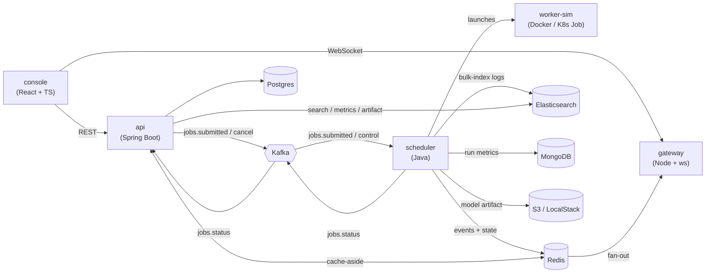

# TrainQueue

A self-serve platform for launching and monitoring distributed ML training jobs.
Submit a job in the browser; a scheduler places and runs it in a container; its
logs, status, and loss curve stream back live; and its logs, artifacts, and run
metrics are persisted for search and download.

**Why it exists:** it's a compact but realistic distributed system — an
event-driven microservice architecture with a message broker, a resource-aware
scheduler, fault tolerance (retries, heartbeats, crash recovery), live streaming,
polyglot persistence, containers/Kubernetes, and CI/CD — the kind of moving parts
a real job platform has, small enough to read end to end.

## Architecture



The api owns the job record and publishes submissions; the **scheduler** owns
execution — priority queue, resource-aware placement, retries, heartbeats, crash
recovery, live streaming, and persistence. Status flows back through Kafka and is
applied by an idempotent state machine.

## Services
- [api/](api/README.md) — REST API + job table; events, cache-aside reads, metrics/artifacts/logs queries.
- [scheduler/](scheduler/README.md) — placement, execution, retries, heartbeat, recovery, streaming, persistence; docker or Kubernetes launcher.
- [gateway/](gateway/README.md) — Node + TS WebSocket fan-out of Redis job event streams.
- [worker-sim/](worker-sim/README.md) — Python training simulator (one JSON log line per epoch; writes a model artifact).
- [console/](console/README.md) — Vite + React + TS dashboard: live job detail page + metrics, artifact, log search.

## Quickstart
Requires Docker Desktop **running** (Java 21 / Node 20 only for the dev workflow below).

**One command — everything in containers:**
```bash
make app    # builds the worker image + all services, starts infra + everything (detached)
```
Then open http://localhost:5173. (The dev API key is `dev-key`, baked into the console image and used by the api/scheduler.) `make down` stops it, `make clean` also wipes the databases.

> Equivalent without `make`: `docker compose --profile app up --build` — the `worker-sim` build-helper service tags `worker-sim:latest` so the scheduler can launch it.

**Or run the services on the host for development:**
```bash
docker compose up -d                          # infra only: postgres(5433) kafka redis mongo localstack/s3 elasticsearch
docker build -t worker-sim:latest worker-sim

cd api       && ./mvnw spring-boot:run        # :8080   (terminal 1)
cd scheduler && ./mvnw spring-boot:run        #         (terminal 2)
cd gateway   && npm install && npm run dev    # :8081   (terminal 3)
cd console   && npm install && npm run dev    # :5173   (terminal 4)
```

Submit a job and click its name for the live detail
page (status, streaming logs, loss curve). After it finishes, use the metrics,
artifact download, and log-search controls. Each service README has its own
run/test commands and a deeper tour of what it does.

## What to try
- **Capacity** — run the scheduler with `TRAINQUEUE_POOL_CPUMILLIS=2000`; submit several jobs → exactly 2 run at once.
- **Retry** — submit with a fail-at-epoch and max-retries > 0 → it fails, retries with backoff, then FAILED.
- **Crash recovery** — start a long job, Ctrl-C the scheduler, restart it → it reconciles and re-adopts or re-queues.
- **Live + search** — two browser tabs on one job stream identically; after completion, search its logs and narrow by time.

## Kubernetes, CI/CD, and deploy
- **Kubernetes** — `LAUNCHER=k8s` runs each job as a K8s Job (fabric8). See [scheduler/README](scheduler/README.md#run-on-minikube) and [deploy/k8s/](deploy/k8s/README.md).
- **CI** — [.github/workflows/ci.yml](.github/workflows/ci.yml): build + test all services on push/PR; push images to GHCR on `main`.
- **Deploy** — [.github/workflows/deploy.yml](.github/workflows/deploy.yml) (manual) → EC2 via [deploy/aws/docker-compose.prod.yml](deploy/aws/docker-compose.prod.yml).

## Tests
```bash
cd api && ./mvnw test         # state machine, controller, ES query-builder, outbox relay (kafka-down)
cd scheduler && ./mvnw test   # resource pool/capacity, ordering, retry policy, run-document mapper
cd gateway && npm test        # subscription registry + fan-out
cd console && npm test        # job table render + detail reducer
```
